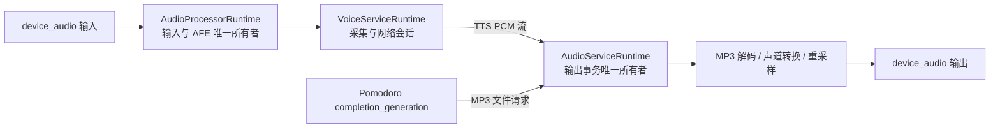

# DeskMate 音频流、MP3 提示音与音频组件 C++ Runtime 整理实施计划

## 目标

一次性完成三项工作：收敛音频输入输出所有权；使用兼容 ESP-IDF 6.0.1 的独立组件从
SD 卡流式播放番茄钟 MP3；将三个音频 Service 整理为“公共 C ABI + 私有 C++ Runtime”。

固定产品边界：提示文件为 `/sdcard/pomodoro-complete.mp3`，最长播放 30 秒；不增加文件
选择 UI、蜂鸣声兜底或 ESP-ADF Pipeline；Hub 的 TTS 仍为 24 kHz 单声道 16-bit PCM。

## 目标架构



- `AudioProcessorRuntime` 独占麦克风启停、读取、硬件采样率到 AFE 16 kHz 的转换和
  Feed/Fetch Task。
- `AudioServiceRuntime` 独占输出启停、播放 Task、PCM StreamBuffer、MP3 解码器和输出转换。
- `VoiceServiceRuntime` 只拥有采集编排、网络会话和 TTS PCM 提交，不再拥有播放 Task。
- `audio_service` 由 Composition Root 启动一次，Light-sleep 期间保持 Task 停泊；
  `app_voice` 只编排 Processor 与 Voice。
- `app_power` 直接读取三个 Service 的事实，待播放、播放、排空和取消都阻止进入睡眠。

## 公共契约

`audio_service.h` 保持 C ABI，并提供：

```c
audio_service_init();
audio_service_start();
audio_service_stop(timeout_ms);
audio_service_deinit();
audio_service_get_status_copy(out_status);

audio_service_request_play_mp3_file_copy(path, request_id);
audio_service_request_cancel_file_playback(request_id);

audio_service_open_pcm_stream(config, timeout_ms, out_stream_id);
audio_service_write_pcm_stream_borrow(
    stream_id, samples, sample_count, timeout_ms, out_written);
audio_service_close_pcm_stream(stream_id, discard, timeout_ms);
```

- ID 均为非零 `uint64_t`；PCM 为有符号 16-bit 交错样本，支持一或二声道。
- 文件请求只有一个活动或待处理槽；相同 ID 合并，不同 ID 在槽占用时明确拒绝。
- PCM 流优先于文件播放：新 PCM 流取消在播 MP3；PCM 期间首个文件请求等待流关闭。
- 每个已接受文件请求发布一次完成、取消或失败事件。
- 删除旧输入、输出、原始读写、音量、静音和冗余状态 Getter。

Processor 状态增加真实 `input_active`；Voice 与 App Voice 状态删除播放及通用音频转发字段；
Power 增加独立播放阻塞位。

## 实施顺序

1. 登记 `play`、`playback` 术语，更新三个组件 README、Service 总览和静态契约。
2. 将 Processor 改为私有 `AudioProcessorRuntime`，直接拥有 `device_audio` 输入，删除硬编码
   24 kHz 假设并保留现有停泊/Drain 语义。
3. 建立私有 `AudioServiceRuntime`、唯一播放 Task、一个文件请求槽和一个 PSRAM PCM
   StreamBuffer；输出按首块 PCM 懒开启，显式排空或丢弃关闭。
4. 将 Voice 改为私有 `VoiceServiceRuntime`，移除旧播放 Task；首个 TTS PCM 才打开流，
   WebSocket 只允许在尚未成功发送任何上行 PCM 字节时回退 HTTP。
5. 精确依赖 `espressif/esp_audio_codec: "2.5.0"`，仅启用 MP3 Simple Decoder；4 KiB
   分块流式解码，单声道化后重采样至设备采样率，按解码样本限制为 30 秒。
6. 设置 `CONFIG_FATFS_FS_LOCK=5`；播放期间文件替换遇到 `EBUSY` 时安全失败并保留原文件。
7. Pomodoro 在解锁并发布完成快照后，以 `completion_generation` 提交播放；Confirm、Reset
   或下一阶段按旧代次取消，播放错误不改变计时状态。

## C++ 边界

- 三个组件公共 `.h`、事件负载和 RTOS 消息保持 C POD；C++ 类只出现在私有 `.hpp/.cpp`。
- 禁止异常、RTTI、全局构造和向队列放入非平凡 C++ 对象。
- 析构函数不执行可能阻塞或失败的清理；保留显式、有界、可重试的 `stop/close/deinit`。
- UI、网页文件服务、Pomodoro、Power 和 Device/BSP 不在本轮 C++ 化范围。

## 验证

- 运行 `check_audio_runtime_contract.ps1`、语音/电源/按键/网页控制台四项现有契约、
  `clang-format --dry-run --Werror` 和 `git diff --check`。
- 只有用户明确要求构建时，才从 DeskSuite 根目录运行 `& .\ds.ps1 build deskmate`。
- 设备验收覆盖常见采样率与声道、损坏/缺失/超长文件、TTS 抢占、睡眠阻塞、上传冲突、
  连续十轮语音与播放的 Heap/栈稳定性；构建结果与物理设备结果分开报告。
