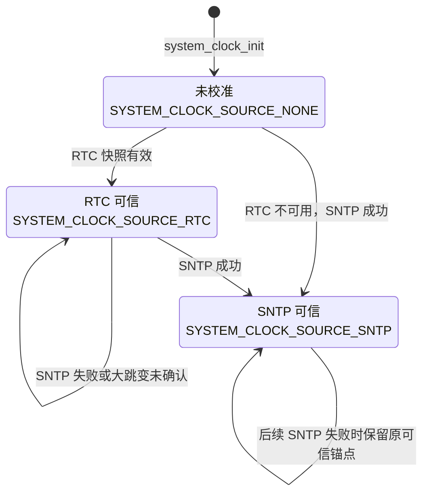
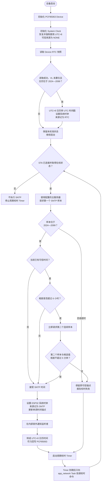

# 时间校准流程

## 1. 概述

DeskMate 使用三类时间能力：

- **PCF85063 RTC**：板载外部实时时钟，保存固定 UTC+8 日历时间，并报告电压过低状态。
- **ESP32 系统时钟**：运行期墙上时钟，通过 `settimeofday()` 设置，以 UTC Unix 时间戳表示。
- **SNTP 网络时间**：Wi-Fi 联网后的最高优先级校准来源，成功后更新 ESP32 系统时钟，并尽力
  回写 PCF85063。

当前数据流为：

```text
启动阶段：PCF85063 RTC → ESP32 系统时钟
联网阶段：SNTP → ESP32 系统时钟 → PCF85063 RTC
```

PCF85063 负责跨重启恢复日历时间，ESP32 系统时钟负责本轮运行中的墙上时间，`esp_timer`
提供单调时间。系统没有额外创建一个持续走时的周期 Timer，也不存在两个软件时钟相互竞争。

RTC 告警调度使用同一可信时间模型：Application 传入 UTC Unix 时间戳，
`system_clock_schedule_rtc_alarm()` 先相对当前可信系统时间校验未来窗口，再转换为固定
UTC+8 日历，最后写入 PCF85063 的秒、分、时、日比较字段。调用方不应自行把 UTC 时间拆成
RTC 本地日历字段。

## 2. 启动顺序

`main/app_main()` 当前按以下顺序初始化：

```text
system_storage_init()
    ↓
settings_store_init()
    ↓
device_rtc_init()
    ↓
system_clock_init()
    ↓
system_clock_sync_from_rtc()
    ↓
app_main_init()
    ↓
app_main_start()
```

`device_rtc_init()`、`system_clock_init()` 等基础能力初始化失败会终止启动。
`system_clock_sync_from_rtc()` 失败只记录警告，产品继续启动，等待联网后的 SNTP 校时。

## 3. 可信时间状态



状态表示本轮运行中最近一次成功接受的可信来源。`system_clock` 同时保存可信 UTC 时间戳和当时
的 `esp_timer` 单调时间锚点。读取当前可信时间时，用单调经过时间推进锚点，而不是直接相信
可能被 SNTP 客户端临时改写的 POSIX 墙上时钟。

## 4. 完整流程



## 5. 关键行为

1. `system_clock_init()` 只创建系统时间能力、读取保存的 UTC 偏移并强制统一为
   `UTC+08:00`（`TZ=CST-8`），不主动读取硬件 RTC。
2. `system_clock_sync_from_rtc()` 通过 `device_rtc_get_snapshot_copy()` 读取完整快照。PCF85063
   的电压过低标志置位时，RTC 日历不可信，系统拒绝使用它；当前没有用编译时间覆盖 RTC 的
   隐式兜底。
3. RTC 和 SNTP 候选必须位于 2024-01-01 至 2099-12-31 的有效范围。
4. `network_manager` 发布 `NETWORK_STATE_ONLINE` 后，`app_network` Task 立即调用一次
   `system_clock_sync_from_sntp()`。校时只使用
   `CONFIG_DESKMATE_TIME_SNTP_PRIMARY_SERVER`，每个样本采用有界超时。
5. 相对当前可信时间跳变不超过 6 小时时直接接受。超过 6 小时时需要第二个连续 SNTP 样本；
   两个候选相差不超过 5 分钟才接受，防止单次异常样本破坏可信锚点。
6. SNTP 成功后先更新 ESP32 系统时钟和单调锚点，再转换成 UTC+8 日历时间尽力回写 RTC。
   RTC 回写失败不会撤销已经接受的系统时间。
7. `CONFIG_DESKMATE_TIME_SNTP_SYNC_INTERVAL_SEC` 大于零时，`app_network` Task 使用 `esp_timer`
   安排后续校时。Timer 回调只投递 `NETWORK_COMMAND_SYNC_TIME`，实际网络 I/O 仍在
   `app_network` Application Task 上下文执行；`network_manager` 离开 `ONLINE` 时停止 Timer。
8. `system_clock` 最多保存四个监听者。接受可信时间后，在内部状态锁之外发送
   `SYSTEM_CLOCK_EVENT_UPDATED`；`home_presenter` 和 `status_bar_presenter` 收到通知后重新拉取时间并
   调度 UI 更新。
9. 日历展示使用可信墙上时钟；重连、超时和清醒期间截止时间使用 `esp_timer` 单调时间。
   不应再增加自定义“每秒累加”的系统 Timer。
10. RTC 告警必须通过 `system_clock_schedule_rtc_alarm()` 从可信 UTC 时间调度。目标必须晚于
    当前可信时间，且不超过 `CONFIG_DESKMATE_RTC_ALARM_MAX_DELAY_SEC`。PCF85063 不比较月份和
    年份，该有界窗口用于避免远期日期重复匹配。
11. GPIO15 的下降沿只在 ISR 中通知 `rtc_service`；Service Task 再读取并清除 AF，释放低电平
    INT 后向 Application 发布事件。中断处理不修改系统时钟，也不参与 SNTP 可信来源选择。
12. PCF85063 Driver 初始化时保留 AIE、AF、告警比较和 CLKOUT 配置，使启动前已经发生的有效
    告警仍可被 `rtc_service` 消费；同时关闭项目未使用的分钟、半分钟和计时器中断并清除 TF，
    防止备份供电期间遗留的非告警来源持续拉低 INT。轻睡眠准备若发现 GPIO15 为低但 AF 未置位，
    BSP 会记录 Control_2、Timer_mode 及各中断位，供区分芯片状态与板级电平故障。

## 6. 错误与降级

| 阶段 | 错误处理 |
| --- | --- |
| RTC Device 初始化失败 | 基础能力不可用，停止应用启动 |
| System Clock 初始化失败 | 时间能力不可用，停止应用启动 |
| RTC 读取失败、VL 置位或日历无效 | 记录警告，保持未校准并继续启动 |
| SNTP 超时、样本越界或大跳变未确认 | 保留原可信锚点，`app_network` Task 记录失败 |
| RTC 回写失败 | 保留已接受的 SNTP 系统时间，仅记录降级日志 |
| RTC 告警目标超出未来窗口 | 拒绝写入，保留原告警配置 |
| RTC 告警 AF 读取或清除失败 | `rtc_service` 发布失败事件，保留错误供 Application 决策 |
| 周期命令投递失败 | 当前回调不阻塞；下一次联网状态变化或周期触发仍可再次校时 |

是否因为长期无法校时而隐藏功能、展示错误或重启属于 Application 产品策略，不由
`system_clock` 决定。

## 7. 主要代码位置

- 系统时钟初始化、RTC/SNTP 校准和可信时间保护：
  [`components/sys/system_clock.c`](../components/sys/system_clock.c)
- System Clock 公共契约：
  [`components/sys/include/system_clock.h`](../components/sys/include/system_clock.h)
- 顶层启动顺序：[`main/main.c`](../main/main.c)
- 联网触发、周期 Timer 和 `app_network` 命令：
  [`main/application/app_network_task.c`](../main/application/app_network_task.c)
- Device RTC 接口：
  [`components/device/device_rtc/`](../components/device/device_rtc/)
- RTC INT 持续消费与 Application 事件：
  [`components/services/rtc_service/`](../components/services/rtc_service/)
- PCF85063 Driver：
  [`components/drivers/pcf85063_driver/`](../components/drivers/pcf85063_driver/)
- 时间变化消费者：
  [`main/presentation/home_presenter.c`](../main/presentation/home_presenter.c)、
  [`main/presentation/status_bar_presenter.c`](../main/presentation/status_bar_presenter.c)
