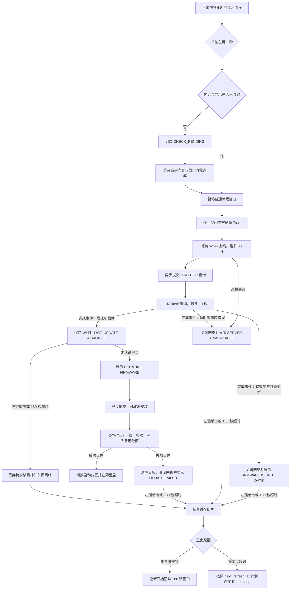

# `power_management_app`

> 唯一拥有正常休眠调度与按键确认式固件更新交互的 Application。

## 1. 定位与职责

- 层级：Application
- 输入：内容轮次、集合显示、用户活动、手动刷新、固件检查和模态按键事实
- 输出：网络会话、OTA Tool、状态页、运行期停机和 ESP32-S3 Deep-sleep

负责把内容刷新、显示收敛、180 秒操作窗口、配网重启、固件检查/确认/退出和深睡串行化到同一个 Task。
固件交互不是持久化模式；正常内容刷新不自动检查固件。

## 2. 正常休眠流程

- 定时唤醒：首轮内容刷新和目标集合显示收敛后，按服务端 `next_refresh_at` 直接再次深睡。
- 按键唤醒或冷启动：收敛后保留 180 秒无活动窗口，成功左右导航会重置窗口。
- 成功轮次使用服务端绝对 UTC 计划；失败跨深睡保留 1/5/15 分钟短期退避，继续失败时使用
  可信 RTC 对齐下一本地整点。RTC 时间不可信时，长期计划才退回相对 60 分钟。
- 自动休眠前必须确认网络已经关闭、照片播放不在刷新、目标集合已显示或明确无内容。
- 网络、显示或恢复错误先进入 `AUTO_SLEEP_BLOCKED` 记录诊断，随后立即按失败退避执行一次
  完整停机；再次失败则进入保底 Deep-sleep，不会无限保持唤醒。
- 网络失败显示 `NO NETWORK`，Hub 失败显示 `NO SERVER`；两页都是显示稳定终态。定时唤醒
  刷新后立即退避深睡，冷启动/按键唤醒保留 180 秒且只接受物理中键三秒长按。
- 本地存储错误不会伪装成连接提示；`NO_CONTENT` 携带本地错误时直接进入失败退避，避免
  `WAIT_DISPLAY` 无界等待。

## 3. 配网重启流程

普通照片页或连接提示页的物理中键持续至少三秒并松开后，本 App 先持久化一次性配网意图，
再按照片、内容、OTA、日志、SD、网络顺序停止运行期组件并重启。新启动由 `provisioning_app`
调用现有 Portal；本 App 不反向依赖或直接运行配网 Application。OTA 模态和安装期间该长按被消费。

## 4. 按键确认式 OTA 流程

规则：

- `CHECK_PENDING`、`CHECKING`、提示页和 `INSTALLING` 均暂停普通休眠截止并拒绝手动休眠。
- 检查开始前停止已经空闲的 `content_refresh_app`，随后由本 App 独占 Network Manager。
- OTA 检查和安装请求成功入队后，本 Task 继续等待通知；OTA 完成回调只复制不可变事件并唤醒
  本 Task，页面、网络和休眠状态仍只在本 Task 中收敛。
- 只有服务端有效响应且没有更高版本时显示最新版；连接、TLS、HTTP、解析错误均显示服务器异常。
- 发现更新后保持 Wi-Fi 最多 180 秒；无更新或检查失败先关网再刷新结果页。
- 安装命令一旦被 OTA Task 接受便不可取消，全部按键和休眠通知都被忽略。
- 每个固件状态页显示前设置一次性恢复标记；正常照片物理恢复成功后才清除。
- 手动退出恢复照片后重新获得 180 秒；提示页超时恢复照片后直接使用原计划深睡。
- 任一网络清理或照片恢复失败先进入 `AUTO_SLEEP_BLOCKED`，随后按失败退避收敛到深睡。
- `INSTALLING` 表示固件正在写入，仍会屏蔽休眠；该状态不属于保底深睡范围。

## 5. 状态与并发

正常路径：`STOPPED → WAIT_REFRESH → WAIT_DISPLAY → AWAKE_WINDOW → PREPARING_SLEEP`。

OTA 路径：`CHECK_PENDING → CHECKING → UPDATE_AVAILABLE/RESULT_PAGE → INSTALLING/RESTORING`。

状态只由电源管理 Runtime 和一个优先级 3、栈 6144 字节的 Task 拥有。照片、网络和 OTA
完成回调只复制事实、发送通知或释放信号量；不会跨 Task 保存借用事件指针。OTA 完成事件采用
单槽覆盖前必须已消费的契约，因为 `firmware_ota` 同一时刻只接受一个事务。Network Manager
的 30 秒建链上限与 OTA HTTP 的 10 秒查询上限分别计算。

## 6. 依赖与生命周期

| 组件 | 用途 |
| --- | --- |
| `photo_playback_app` | 普通刷新请求、模态按键、状态页、照片恢复、显示收敛 |
| `content_refresh_app` | 正常内容轮次；OTA 开始时停止空闲 Task |
| `network_manager` | OTA 独占在线会话和有界清理 |
| `firmware_ota` | 异步查询、完成事件、缓存目标、丢弃和不可取消安装 |
| `system_storage` | 固件状态页一次性恢复标记 |
| `device_buzzer` | 检查开始时短提示音 |
| `device_power`、`device_display`、`sd_card_service` 等 | 有序停机、回滚和深睡 |

公共生命周期为 `init → start → stop → deinit`。进入深睡时依次停止照片、内容、OTA、日志、
SD 和网络；首次准备失败先反向恢复，再按失败退避完整重试一次。第二次准备仍失败时，不再依赖
组件终态确认，只最佳努力关闭蜂鸣器和 LED、重建按键与定时器唤醒源并进入保底 Deep-sleep；
若唤醒源无法配置则立即重启，由启动流程重新收敛。OTA 手动退出后内容 Task 可保持停止到休眠，
确认键长按会重新启动它。

运行期尚未初始化时，`bootstart_app` 可以调用同步启动失败深睡入口。该入口复用相同停机顺序，
但把尚未初始化的照片、内容、OTA、日志、SD、网络和显示视为无需清理，以便系统基础或局部
初始化失败也能进入 1/5/15 分钟退避深睡，继续失败时对齐可信 RTC 的下一本地整点；RTC 时间
不可信时退回相对 60 分钟。这个宽松规则只用于
启动失败收敛；运行期自动和手动休眠的首次尝试仍要求网络、显示及所有已启动资源达到严格终态。

## 7. 验证

验证检查命令提交后立即返回、完成事件唤醒、重复请求拒绝、队列满明确报错、30 秒网络失败、
10 秒查询超时、有效无更新、发现更新但不下载、左键取消、确认安装、下载失败、成功重启、
右键屏蔽、提示页 180 秒超时、普通导航与确认键长按不回归，以及等待确认不休眠、安装不可
停机、清理失败立即提交失败退避、长期失败对齐 RTC 下一本地整点、绝对目标跨深睡门禁、
完整停机再次失败进入保底深睡、按键/定时器唤醒保持原行为。
