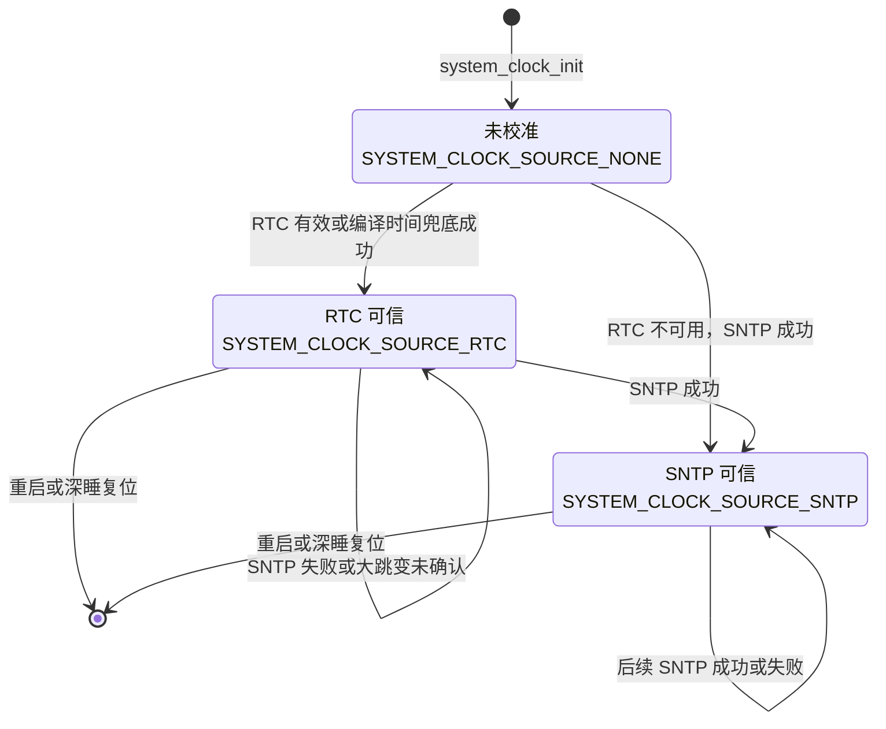
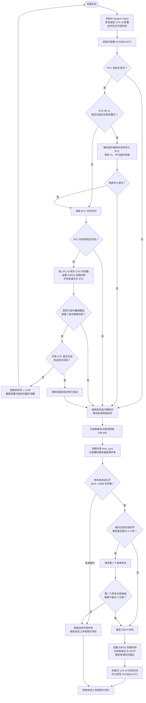

# 时间校准流程

## 1. 概述

设备使用三类时间能力：

- **PCF8563 RTC**：板载外部实时时钟，断电后依靠后备电源继续走时，保存的是固定 UTC+8 日历时间。
- **ESP32 系统时钟**：运行期使用的墙上时钟，通过 `settimeofday()` 设置，以 UTC Unix 时间戳表示。
- **SNTP 网络时间**：网络上线后的最高优先级校准来源；共享 Communication `time_sync`
  只取得单次网络样本，PhotoPainter `system_clock` 校验并接受后更新 ESP32 系统时钟，再
  尽力回写 PCF8563。

因此，当前流程不是单向的“SNTP → RTC → ESP32”，而是：

```text
启动阶段：PCF8563 RTC → ESP32 系统时钟
联网阶段：SNTP → ESP32 系统时钟 → PCF8563 RTC
```

## 2. 可信时间状态图



状态表示本轮运行中最近一次成功校准所采用的可信来源。运行期以 ESP32 系统时钟和可信时间锚点为主；PCF8563 只在启动时用于恢复时间，SNTP 成功后才被回写，不存在持续的双向同步任务。

## 3. 时间校准流程图



## 4. 关键行为

1. `system_clock_init()` 只初始化系统时间能力和 UTC+8 时区，不主动读取硬件 RTC。
2. 启动时由 `main_init_rtc()` 初始化 PCF8563，并调用 `system_clock_sync_from_rtc()` 恢复 ESP32 系统时钟。
3. RTC 的 `VL` 标志置位时，原日历时间不可信；系统先写入固件编译时间作为临时兜底。
4. 每轮内容刷新在网络上线后、状态上传和照片同步前执行一次 SNTP 校时。
   `system_clock` 调用共享 `time_sync_sample_sntp_once_copy()` 取得样本；`time_sync` 串行
   管理 ESP-NETIF 全局 SNTP 客户端，但不决定候选范围、二次确认或 RTC 回写。
5. SNTP 时间成功接受后，先更新 ESP32 系统时钟和可信锚点，再将 UTC 时间转换成 UTC+8 回写 PCF8563。
6. SNTP 失败或 RTC 回写失败都采用降级处理：保留当前有效系统时间，并继续本轮业务流程。
7. ESP32 的 `esp_timer` 只用于从可信锚点推算经过时间和抵御墙上时钟异常，不代替 PCF8563 保存跨断电日历时间。
8. 成功刷新得到的绝对 UTC 目标会跨深睡保存在 RTC 内存。定时器唤醒后若可信时间尚未达到
   目标，设备会在环境、SD、显示和网络启动前，按剩余时间再加 10 秒重新深睡。
9. 固定 10 秒补偿只用于服务端绝对刷新目标，允许稍晚唤醒；失败退避和手动休眠不增加补偿。

## 5. 主要代码位置

- 系统时钟初始化、RTC/SNTP 校准和可信时间保护：[`components/sys/system_clock.c`](../components/sys/system_clock.c)
- 共享 SNTP 单样本网络取样：[`../../../shared/components/communication/time_sync/`](../../../shared/components/communication/time_sync/)
- RTC 启动恢复及编译时间兜底：[`main/main.c`](../main/main.c)
- 网络上线后的 SNTP 触发：[`components/application/content_refresh_app/src/content_refresh_app_task.cpp`](../components/application/content_refresh_app/src/content_refresh_app_task.cpp)
- Device RTC 接口：[`components/device/device_rtc/src/device_rtc.c`](../components/device/device_rtc/src/device_rtc.c)
- PCF8563 寄存器读写：[`components/drivers/pcf8563/pcf8563.c`](../components/drivers/pcf8563/pcf8563.c)
